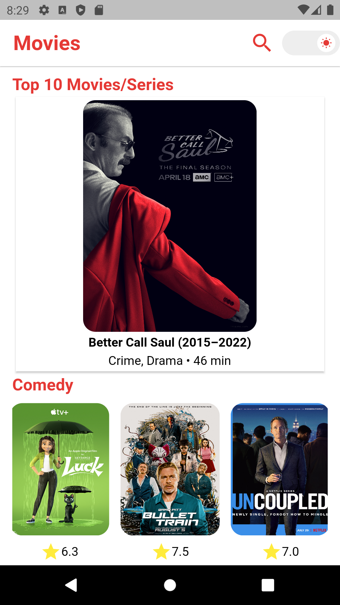
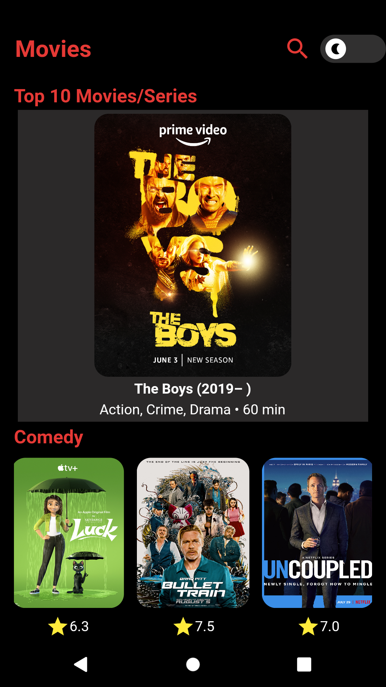
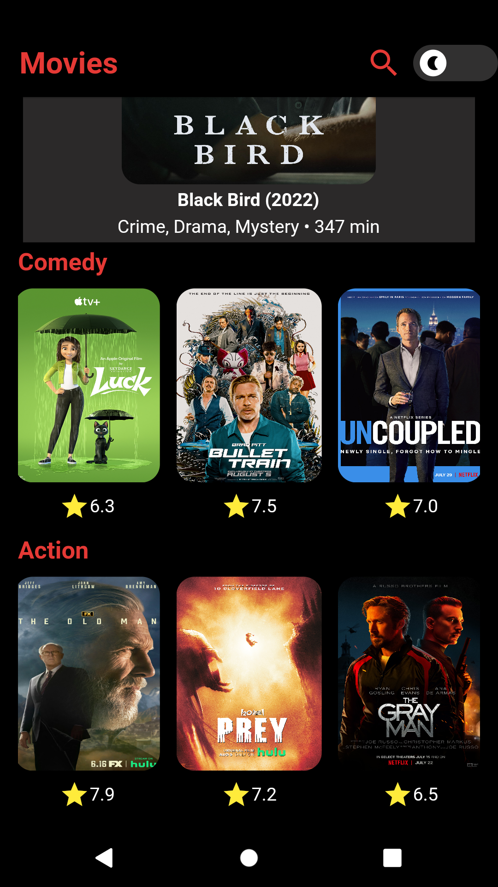
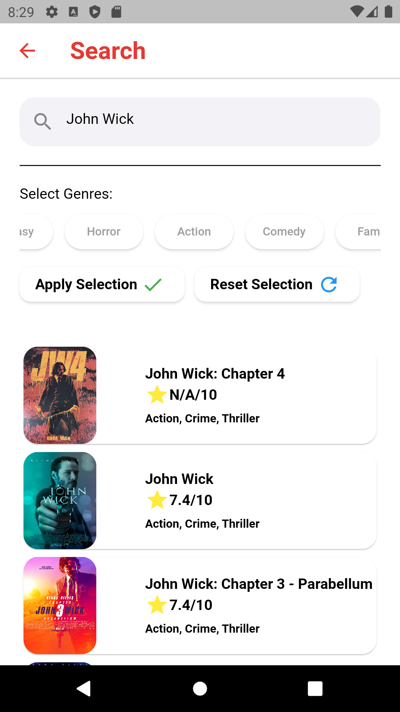
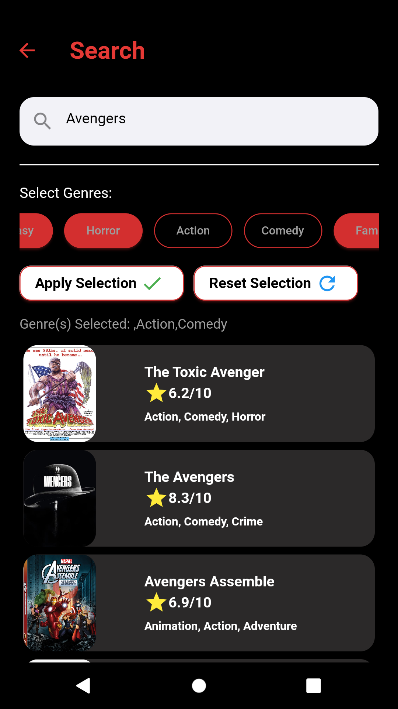
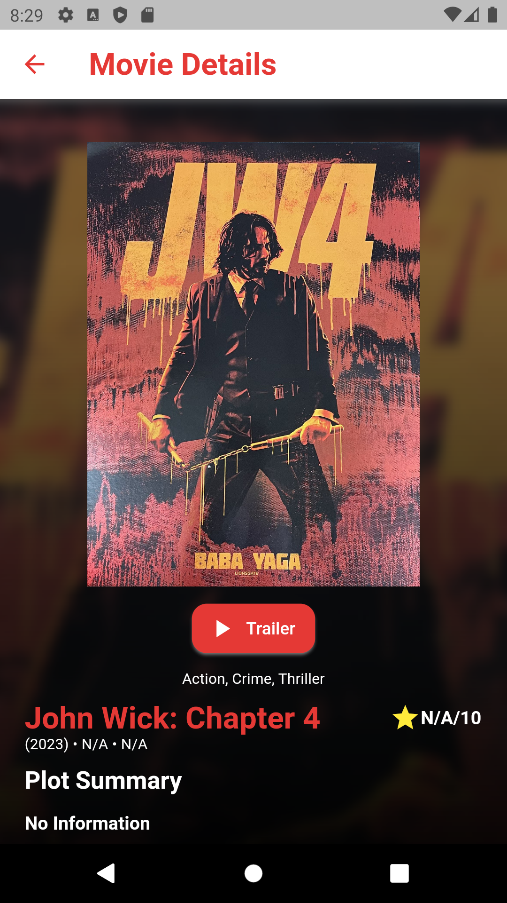
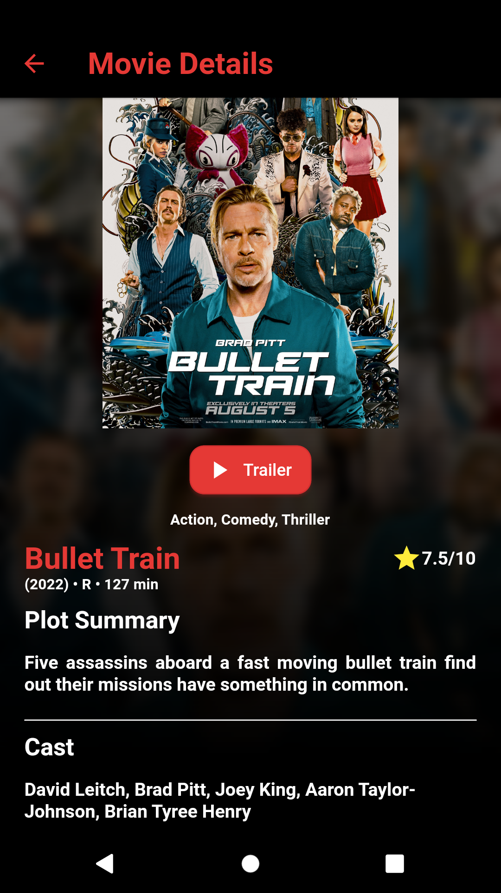

# IMDB API Movie Flutter Application
## Homepage
1. Light Mode  

2. Dark Mode  

## Search Page
1. Light Mode  

2. Dark Mode  

## Movie Detail Page
1. Light Mode and Dark Mode  

## Trailer
 