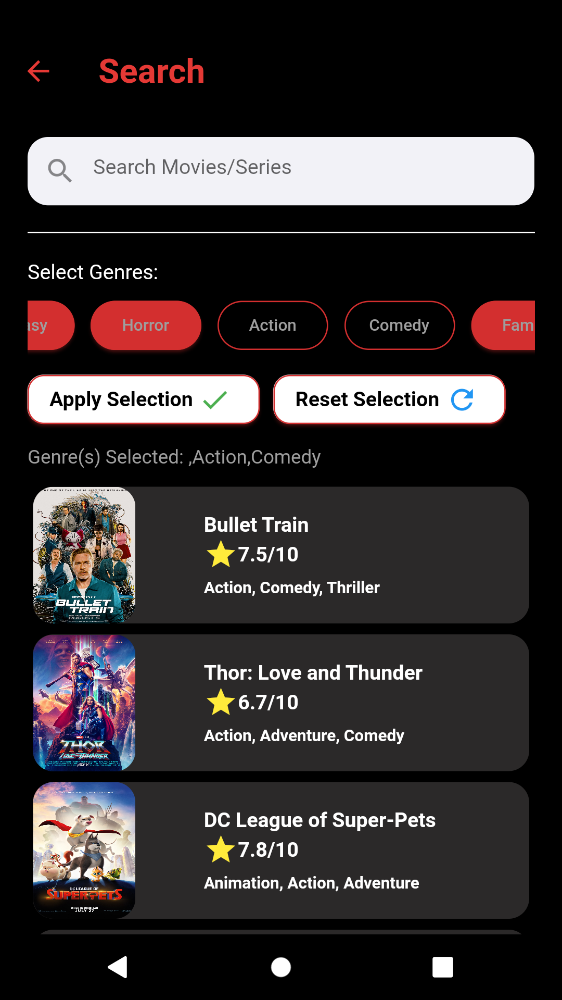
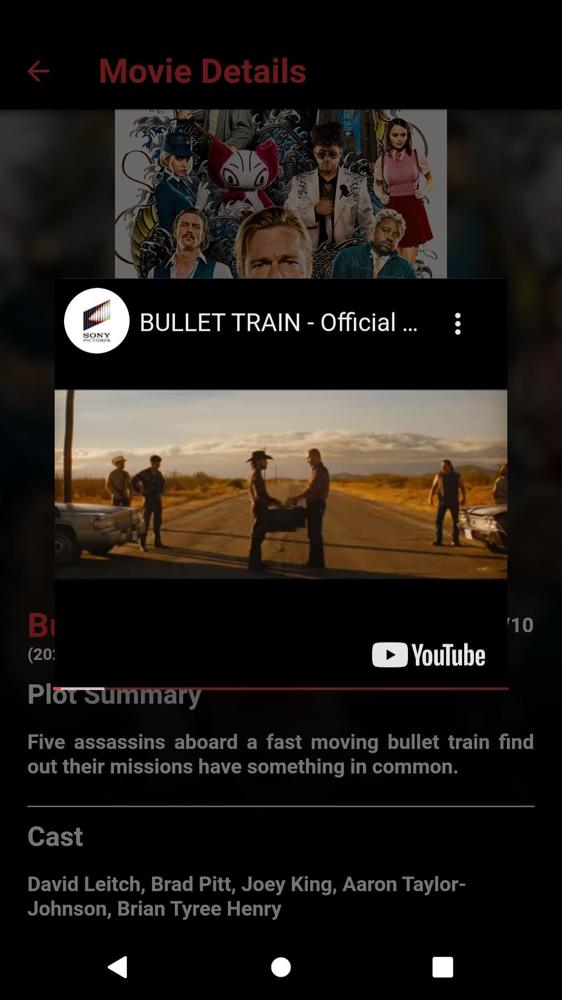

# IMDB API Movie Flutter Application
1. The flutter mobile application that was developed is a movie application that used the IMDB API.
2. The functions includes: 
```
  - Show movies lists based on genres(i.e top 10 movies, comedy, action and so on)  
  - A movie detail page that show more informations about the selected movies  
  - Movie detail page includes the trailer of the movie if available  
  - Search by name function  
  - Search by genre function  
  - Search by name and genre function  
```

# Screenshots
## Homepage
1. Light Mode  
      
2. Dark Mode  
      

## Search Page
1. Light Mode  
      
2. Dark Mode  
      

## Movie Detail Page
1. Light Mode and Dark Mode  
      

## Trailer
1. Movie Trailer  
 

# Demonstration


https://user-images.githubusercontent.com/108507245/184382353-3ff78f25-a465-4cdc-b16d-f1c92bd6b94b.mp4


https://user-images.githubusercontent.com/108507245/184382426-eb18325b-bda9-4fad-a3c0-a670cb263017.mp4

